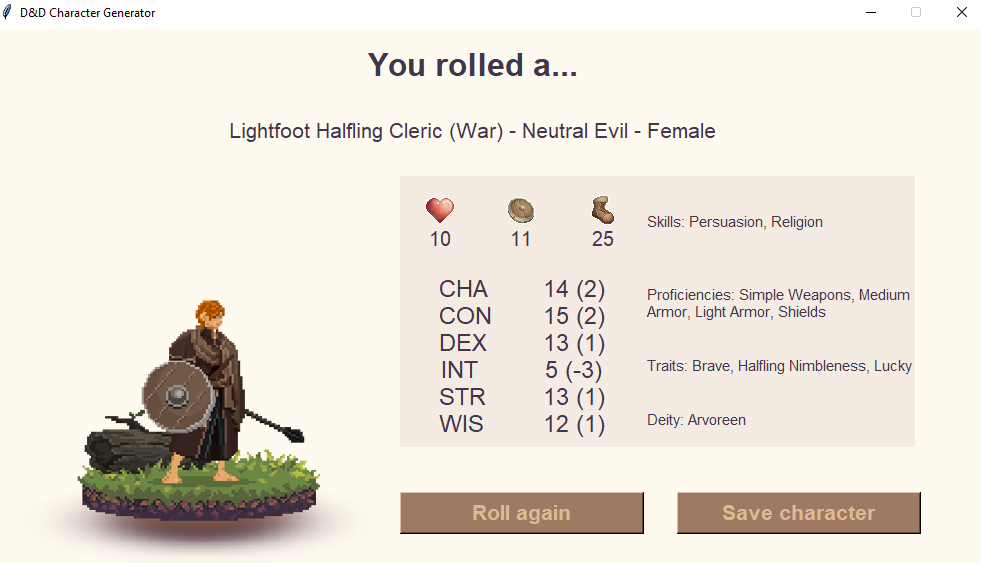

## Project overview

Dungeons and Dragons is a fantasy tabletop roleplaying game where each player gets to create and embody a character with a distinctive set of traits, abilities and gear. 

While the customization options are endless, they can also be overwhelming to a) new players and b) people (like myself) who come up with new character ideas every 5 minutes and cannot commit to a single one throughout a campaign. 

To remedy this issue while having fun discovering Python, I created this level 1 random character generator for Dungeons and Dragons 5th edition. 

The project itself revolves around:

- A Jupyter notebook used to collect data and generate the `dataset.json` file, a dictionary of all informations about races, classes and their respective variations in D&D 5th edition. Helper functions used to collect data are stored in the /lib folder.
- A `character_generator.py` file, used to generate the random character.
- An `app.py` file, running the Tkinter GUI app.

### Resources

In order to build the dataset used by this program, the following resources were used:

- The D&D 5e API available at https://www.dnd5eapi.co/.
- The Forgotten Realms Wiki available at https://forgottenrealms.fandom.com/wiki/.
- Dungeons and Dragons 5th edition - Player's Handbook.

The awesome https://www.reroll.co/ app was used to generate pixel art character sprites. Other assets / icons come from https://cainos.itch.io/pixel-art-icon-pack-rpg.

### Requirements

Requirements for using this code are available in the `requirements.txt` file.

Each package can be installed using the Pip command, or in conda with:

`conda create --name <env> --file requirements.txt`

### Run the generator

Open the command line and navigate to the folder containing `app.py`

Then simply type:

`python app.py`

Follow instructions in the app to either keep generating random characters, or save the currently printed character to a text file.

## What I learned

This project started as a fun exploration project to get familiar with Python, and as it progressed I learned how to:

- Collect data from APIs and webscraping (using the requests and Selenium packages)
- Use Python functions, classes, and handle various data structures (dictionaries, lists, strings)
- Make an (almost) unhealthy use of the random package
- Use Tkinter to create a simple GUI.

## What's next?

Some features are currently missing to call this character complete: background and occupation, proper starting inventory and - why not - a name.
